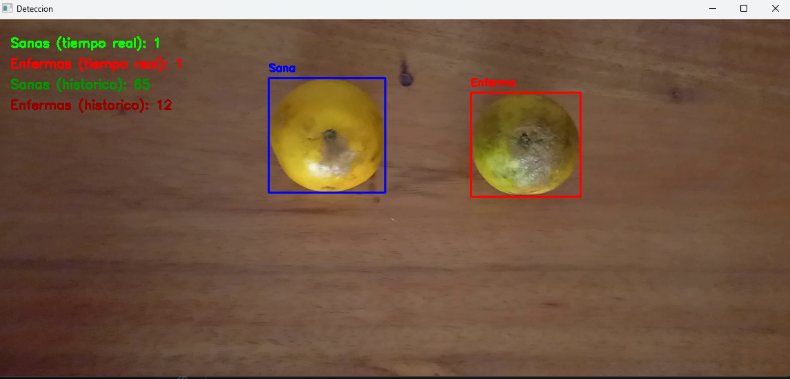
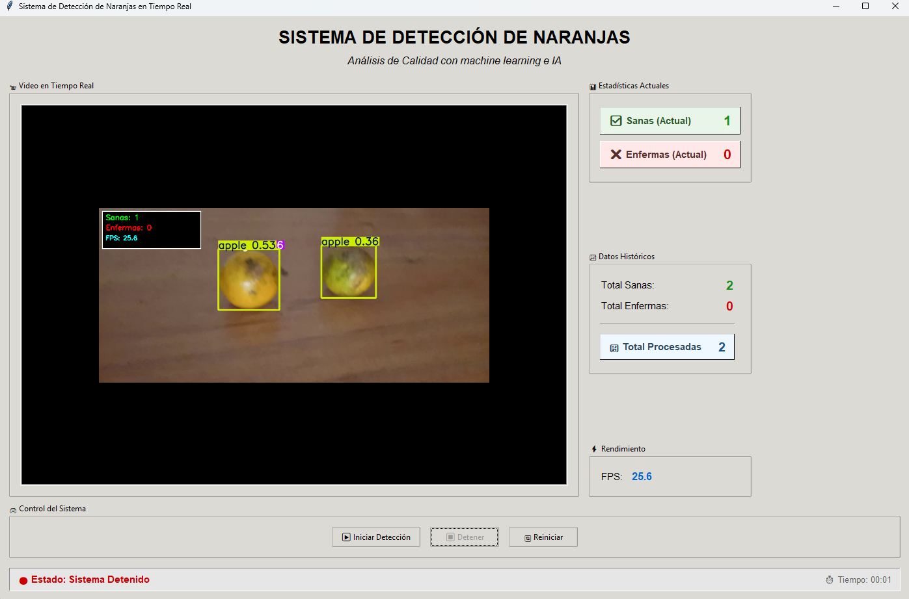

# Detección de Plagas en Naranjas

Detección de plagas en naranjas usando YOLO v8 y OpenCV.

### Clases (Data)
- Verdes
- Fresco
- Cancro
- Puntos negros

### Archivos
- `01_captura.py` - Captura imágenes con cámara
- `02_etiquetado.py` - Etiqueta imágenes automáticamente
- `03_dataset.py` - Crea dataset para entrenamiento
- `04_entrenamiento.py` - Entrena modelo YOLO
- `05_prueba.py` - Detección en tiempo real
- `yolov8n.pt` - Modelo preentrenado
- `README.md` - Documentación del proyecto

### Estructura
```
deteccion_nrj/
├── img/
│   ├── caract.prj open cv.txt
│   ├── deteccion de plaga (naranjas).png (screenshot1)
│   ├── interfaz de deteccion de plaga naranjas.png (screenshot2)
│   └── monton-naranjas-manchas-negras-ellas_77316-66.jpeg
├── video/
│   ├── naranjas.mp4
│   ├── nrj_bucle.mp4
│   ├── nrj_video.mp4
│   └── readme.txt
├── 01_captura.py
├── 02_etiquetado.py
├── 03_dataset.py
├── 04_entrenamiento.py
├── 05_prueba.py
├── README.md
└── yolov8n.pt
```

### Uso
1. Ejecutar archivos en orden (01 → 05)
2. El modelo entrenado se guarda en `runs/detect/objetos/weights/best.pt`
3. Dataset disponible: https://qu.ax/eOgcY.zip

### Requisitos
```
ultralytics
opencv-python
pyyaml
```
## Captura de Pantalla
Aquí tenemos la captura de pantalla del proyecto:






## Licencia
Este proyecto está bajo la licencia MIT. Consulta el archivo LICENSE para más detalles.